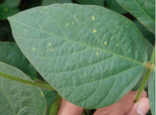
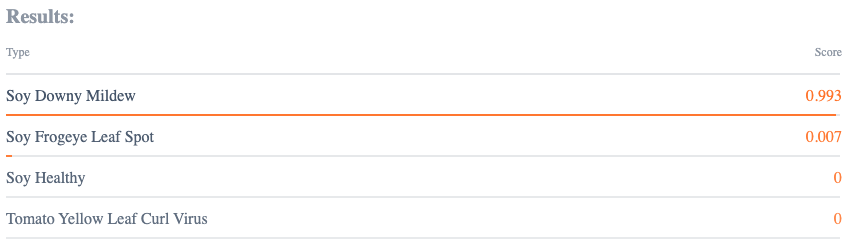
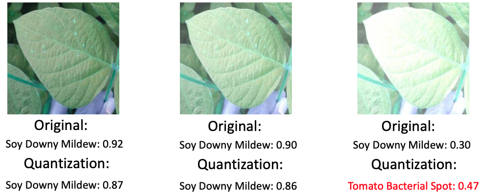

We present an motivating example from a real-world application 
provided by AgriPredict [1] to illustrate the problem we are 
interested in. In this example, the model is developed to automatically diagnose 
plant diseases, which serves as an effective tool for farmers to prevent vital loss. 
Given an image with a crop, the model will predict the potential disease the crop could have.
More specifically, the provided model treats this disease prediction problem as a 
16-class classification task, i.e., the diseases have 16 categories. Figure 1 
depicts the screenshot we took from the official website [2] of the input and
output of the TensorFlow version model (before quantization). According to the prediction of the model,
this crop most likely has the Soy Downy Mildew with the highest possibility among all diseases.

##### Figure 1: Example of crop disease classification application provided by AgriPredict.

  

AgriPredict also provides the TensorFlowLite version of the model (after quantization). 
Therefore, given the two versions of model and the input data, we can check if there are 
disagreements between these two models. We utilize the widely used image transformation 
technique to add brightness to the image and 
create more data that cover diverse environment situations. Then, we feed these data to 
the two models and check their outputs. Figure 2 shows the 
Top-1 predictions with the probabilities by the two models. We can see after the environment
changes, the model before quantization stills holds the ability to correctly predict the disease, 
although the prediction confidence decreases. For example, with the highest brightness, 
the prediction confidence degrades from 0.92 to 0.30. However, the quantized model 
occasionally gives a wrong diagnose (e.g., Tomato Bacterial Spot for the third image). 
In addition, in the first two images, the original model is more accurate than the 
quantized model with higher prediction possibility in the correct disease. 
This phenomenon raises the security risk that, after quantization, 
the model may produce different and unexpected results when dealing with the same data.

##### Figure 2: The Top-1 prediction (disease class and possibility) results of the  original model and its quantization version.

 

[1] https://www.agripredict.com/

[2] https://tfhub.dev/agripredict/disease-classification/1
